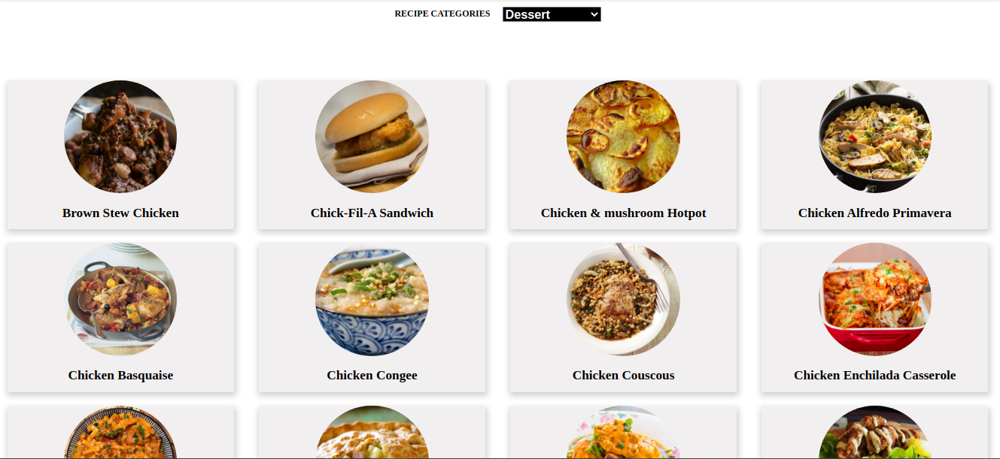
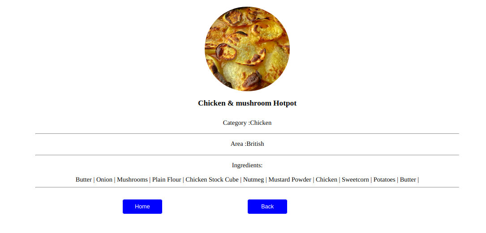

## Recipe catalogue

This is a React web application where you can navigate the details of the different food categories and food recipes by clicking on the list of categories listed. It has the filter functionality with which you can filter your your recipe with different categories.

## Images

## Live demo
[Recipe Catalogue]()

## Video Presentation
[View its presentation in a video]()

This project was bootstrapped with [Create React App](https://github.com/facebook/create-react-app).

## Built with
- React
- HTML
- CSS
- JavaScript/ES6
- React Hooks
- React Router
- Redux
- Boostrap
- React Redux
- MealsApi
- Heroku

### Prerequisites

- Node
- Npm

### Setup

- clone into your machine `git clone https://github.com/Phylis05/Recipe-Catalogue.git`
- cd Recipe Catalogue
- run `npm install`
- run `npm run start`

## Author

👤 **Phylis Chepchumba**

- Github: [Phylis05](https://github.com/phylis05)
- Linkedin: [Phylis Chepchumba](https://linkedin.com/phylis-chepchumba)
- Twitter: [phyl_chumba](https://twitter.com/phyl_chumba)
## 🤝 Contributing

Contributions, issues and feature requests are welcome!

Feel free to check the [issues page](https://github.com/Phylis05/Recipe-Catalogue/issues).

## Show your support

Give a ⭐️ if you like this project!

## Acknowledgments

- MIcroverse
- Microverse TSE's

## 📝 License

